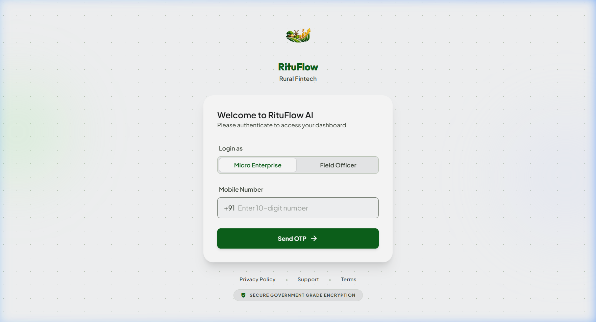
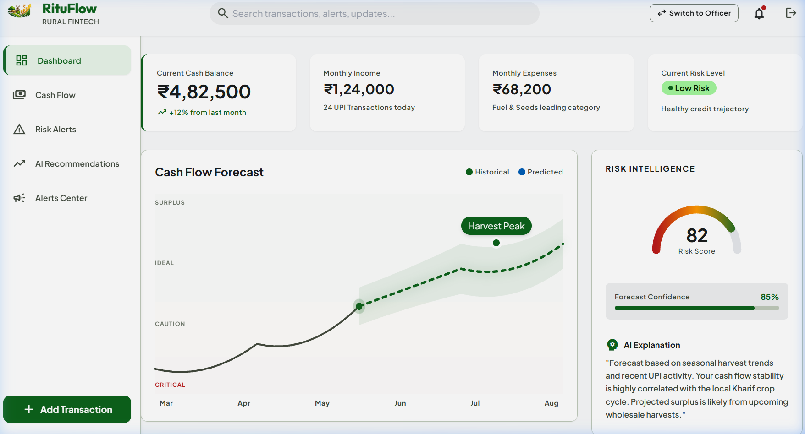
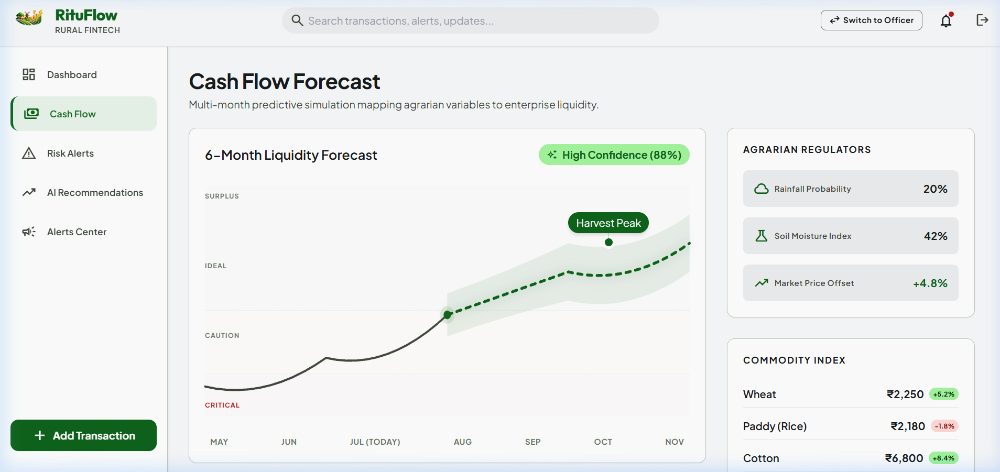
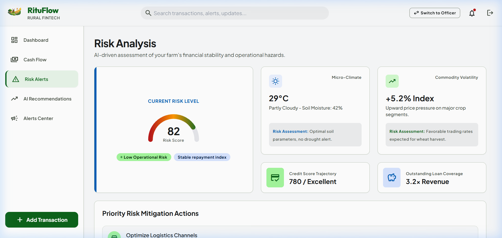
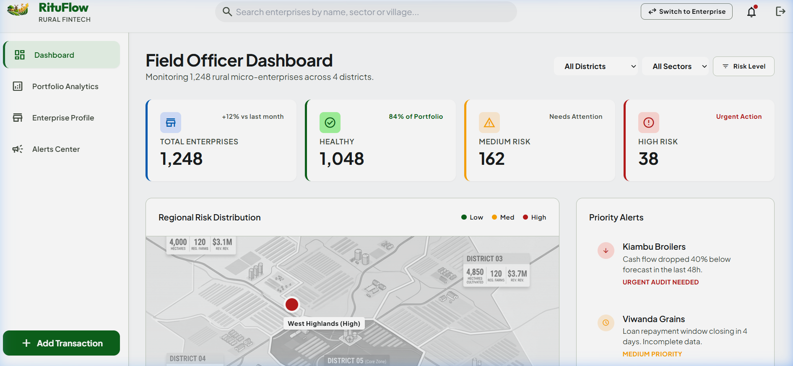
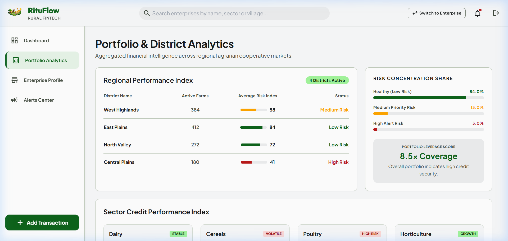

# 🌾 RituFlow | Smart Rural Fintech Platform

**🔗 Live Demo:** [https://rituflow.onrender.com/](https://rituflow.onrender.com/)

RituFlow (named after *"Ritu"*, the Sanskrit word for season) is an intelligent agronomic-credit and financial dashboard designed for rural micro-enterprises, smallholder farmers, and agricultural credit/field officers. 

By integrating seasonal crop cycles, real-time UPI transaction metrics, weather inputs, and commodity prices, RituFlow provides advanced cashflow forecasting, risk analysis, and credit tracking for agricultural ecosystems.

---

## 🚀 Key Portals

RituFlow is structured as a dual-portal application to serve both rural business owners and the financial officers monitoring their health:

### 1. 🧑‍🌾 Enterprise Portal (Farmers & Micro-Enterprises)
Empowers rural businesses to track their financial performance, manage loans, and make informed choices based on seasonal trends:
* **Interactive Dashboard:** Tracks current balances, active loan status, live commodity prices (Wheat, Rice, Cotton, etc.), and local weather forecasts.
* **Cashflow Forecasting:** Provides seasonal projections (e.g., mapping cash surplus correlation with the local crop cycle).
* **AI Financial & Agronomic Insights:** Context-specific recommendations (e.g., advising on inventory delays based on predicted wholesale drops, recommending fertilizer timing based on weather/soil moisture, and suggesting savings redirection).
* **Risk & Credit Status:** Transparent tracking of risk level trajectories and Credit Scores (modeled around Kisan Credit Cards and working capital lines).

### 2. 👮 Field Officer Portal (Credit & Risk Officers)
Provides micro-finance institutions and banks with the tools to manage field operations and audit credit portfolios:
* **Officer Dashboard:** High-level summaries of total active portfolios, average risk indices, and priority tasks.
* **Detailed Enterprise Profiles:** Exhaustive views of individual enterprise metrics, balance history, UPI vs. cash ratios, outstanding loan timelines, and recent transaction Ledgers.
* **Regional & Sector Analytics:** Interactive breakdowns of active counts, outstanding loan percentages, average credit scores, and risk distributions across districts (e.g., West Highlands, East Plains) and sectors (Dairy, Cereals, Poultry, Horticulture).

---

## 🖼️ Application Interfaces (Prototype Screenshots)

Here is a visual overview of the RituFlow prototype:

### 🔐 Secure Login Portal
Allows role-based access for either a Micro-Enterprise owner or a Field Credit Officer.


### 🌾 Enterprise Portal (Farmers & Rural Micro-Enterprises)
Interactive tools mapping agricultural events, weather constraints, and cash flow forecasting.

| 📊 1. Enterprise Dashboard | 📈 2. Cashflow Forecast | 🛡️ 3. Risk Analysis |
| :---: | :---: | :---: |
|  |  |  |

### 👮 Field Officer Portal (Portfolio Analytics & Monitoring)
Aggregated district and sector views designed for micro-lending risk mitigation.

| 🗃️ 1. Officer Dashboard | 📉 2. Sector & District Analytics |
| :---: | :---: |
|  |  |

---

## 🛠️ Technology Stack

* **Frontend Framework:** [React 18](https://react.dev/) (with dynamic routing powered by `react-router-dom` v6)
* **Build System:** [Vite](https://vitejs.dev/) (Vite Dev Server, optimized HMR)
* **Styling & UI Tokens:** [Tailwind CSS v3](https://tailwindcss.com/) with a custom design system:
  * Google Fonts: **Outfit** and **Plus Jakarta Sans** for typography.
  * **Material Symbols Outlined** icons for clear, accessible iconography.
  * Curated **HSL Palette** mapping semantic states (primary, tertiary, error-container, outline, surface-bright).
  * Smooth animations and **Glassmorphism** card backdrops.
* **Custom SVG Visualizations:** Hand-crafted, responsive SVG chart components (instead of heavy external charting packages):
  * `RiskGauge`: Displays dynamic credit risk health using custom SVG arcs and linear color gradients.
  * `AreaChart`: Visualizes predicted vs. historical cashflow zones (Surplus, Ideal, Caution, Critical) with confidence boundaries and animated markers.
  * `BarChart` & `LineChart`: Clean vector charts showing transaction and distribution metrics.

---

## 📂 Project Directory Structure

```text
Rituflow/
├── public/                  # Static assets and icons
├── src/
│   ├── components/          # Reusable UI Components
│   │   ├── charts/          # Custom SVG Chart components (AreaChart, RiskGauge, etc.)
│   │   ├── navbar/          # Top navigation layout
│   │   └── sidebar/         # Dynamic sidebar navigation
│   ├── layouts/             # Dashboard and Authentication layouts
│   ├── mock/                # Mock Data JSONs (Analytics, Enterprise database, Dashboard)
│   ├── pages/               # Views separated by domain
│   │   ├── Alerts/          # Notifications & Alerts page
│   │   ├── Auth/            # Authentication & Login views
│   │   ├── Enterprise/      # Pages for the Enterprise Portal
│   │   └── Officer/         # Pages for the Field Officer Portal
│   ├── routes/              # App routing setup (AppRoutes.jsx)
│   ├── styles/              # Global Tailwind style sheet (index.css)
│   ├── App.jsx              # Main App entry with routing wrappers
│   └── main.jsx             # React DOM mounting logic
├── index.html               # Main HTML Document entry
├── tailwind.config.js       # Tailwind system configuration
├── vite.config.js           # Vite build configurations
└── package.json             # App dependencies & run scripts
```

---

## ⚙️ Getting Started

### Prerequisites
Make sure you have [Node.js](https://nodejs.org/) installed on your machine.

### Installation
1. Clone the repository or navigate to the project directory:
   ```bash
   cd Rituflow
   ```

2. Install dependencies:
   ```bash
   npm install
   ```

### Running Locally
To launch the Vite development server:
```bash
npm run dev
```
Open [http://localhost:5173](http://localhost:5173) in your browser to view the application.

### Building for Production
To build the application for deployment:
```bash
npm run build
```

The build output will be stored in the `/dist` directory.

### Previewing Production Build
To preview the generated production build locally:
```bash
npm run preview
```

---

## 💡 Key Design Implementation Details

* **Dynamic Risk Zones:** The cash flow forecast charts overlay historical and forecasted cash levels against caution and critical boundaries, providing visual triggers when cash drops below a safety baseline.
* **UPI-to-Cash Analytics:** Features a clear visual ratio of UPI transactions (digital ledger footprint) compared to traditional cash flow, which assists credit officers in evaluating credit eligibility.
* **Harvest Peaks:** Time-series charts contain markers signifying local agricultural harvest peaks to contextually map cash flow trends to physical harvest seasons.
